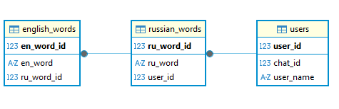

# 📘 English Words Teach Bot

Telegram-бот, который помогает изучать английские слова: переводит, сохраняет в личный словарь и проводит интерактивные мини-уроки с вариантами ответов.

---

# 📑 Оглавление

* [Описание](#-описание)
* [Основные возможности](#-основные-возможности)
* [Используемые технологии](#-используемые-технологии)
* [Структура проекта](#-структура-проекта)
* [Установка и запуск](#-установка-и-запуск)
* [Переменные окружения](#-переменные-окружения)
* [Работа с базой данных](#-работа-с-базой-данных)
* [Работа с переводами](#-работа-с-переводами)
* [Основная бизнес-логика](#-основная-бизнес-логика)
* [Как работают уроки](#-как-работают-уроки)
* [Тестирование](#-тестирование)
* [Планы по развитию](#-планы-по-развитию)

---

# 📝 Описание

English Words Teach Bot — это простой, но полезный Telegram-бот для изучения английского языка.
Каждый пользователь получает собственный словарь, куда может добавлять новые слова.
Для перевода используется API Yandex Dictionary.

После накопления слов бот может проводить уроки, предлагая выбрать правильный перевод среди четырёх вариантов.

---

# ⭐ Основные возможности

* Регистрация пользователя через `/start`
* Автоматическое добавление базового набора слов
* Перевод русских слов через API Яндекса
* Хранение слов пользователя в базе данных
* Проверка уникальности слов
* Добавление/удаление слов через команды и кнопки
* Интерактивные уроки:

  * правильный перевод
  * 3 случайные неправильные варианты
* Подсчёт пользовательской статистики

---

# 🛠 Используемые технологии

| Технология            | Описание                           |
| --------------------- | ---------------------------------- |
| Python 3.10+          | Основной язык                      |
| Telebot (async)       | Telegram API                       |
| SQLAlchemy ORM        | Работа с БД                        |
| SQLite (по умолчанию) | Для тестов и локального запуска    |
| PostgreSQL            | Поддержка есть, но не активирована |
| Yandex Dictionary API | Перевод слов                       |
| dotenv                | Работа с переменными окружения     |

---

# 📁 Структура проекта

```
ENG_words_teach_bot/
│
├── ENG_words_teach_bot_code/
│   ├── db_tables_create.py        # ORM-модели и схема БД
│   ├── def_translate.py           # Интеграция с API Яндекса
│   ├── work_with_storage.py       # CRUD-операции и бизнес-логика
│   ├── main.py                    # Telegram-бот, обработчики команд
│   └── tests/                     # Автоматические тесты
│
├── requirements.txt
├── .env
└── README.md
```

Каждый модуль выполняет одну задачу:
модели — отдельно, БД — отдельно, Telegram-логика — отдельно.



---

# ⚙ Установка и запуск

### 1. Склонируйте проект

```bash
git clone <url>
cd ENG_words_teach_bot
```

### 2. Создайте виртуальное окружение

```bash
python -m venv .venv
source .venv/bin/activate       # Linux/Mac
.\.venv\Scripts\activate        # Windows
```

### 3. Установите зависимости

```bash
pip install -r requirements.txt
```

### 4. Настройте `.env` файл (см. раздел ниже)

### 5. Запустите бота

```bash
python ENG_words_teach_bot_code/main.py
```

---

# 🔐 Переменные окружения

Файл `.env` должен содержать:

```
TG_BOT_TOKEN=телеграм_токен
API_YANDEX_DICT_TOKEN=токен_яндекса
SECRET_KEY=пароль_для_postgres
```

PostgreSQL используется опционально — по умолчанию активна SQLite in-memory база для удобства разработки.

---

# 🗄 Работа с базой данных

В проекте три таблицы:

### `users`

* chat_id
* имя пользователя

### `russian_words`

* русское слово
* ссылка на пользователя
* уникальность в пределах пользователя

### `english_words`

* один или два перевода
* связь 1:N с русским словом

#### Связи:

```
User → RussianWord → EnglishWord
1 → N → N
```

Удаление русcкого слова автоматически удаляет его переводы.

---

# 🔤 Работа с переводами

Модуль `def_translate.py` делает запрос:

```
GET https://dictionary.yandex.net/api/v1/dicservice.json/lookup
```

Функция `translate_word()`:

* принимает русское слово
* возвращает `(перевод1, перевод2)` или `(None, None)`
* обрабатывает ошибки сети и API

Если второй перевод отсутствует — возвращает `None`.

---

# ⚙ Основная бизнес-логика

Всё хранение и операции с БД вынесены в `work_with_storage.py`.

Основные функции:

### ✔ add_client(chat_id, name)

Добавляет пользователя, если его нет.

### ✔ uniqe_word(word, chat_id)

Проверяет, есть ли слово в словаре.

### ✔ add_word_with_translations(...)

Добавляет русское слово и его перевод(ы).

### ✔ delete_word(word, chat_id)

Удаляет слово у пользователя.

### ✔ count_user_english_words(chat_id)

Подсчёт всех английских слов.

### ✔ random_right_ru_en_couple(chat_id)

Главная функция для уроков:
возвращает случайное русское слово, его правильный перевод и три неправильных варианта.

---

# 🎓 Как работают уроки

Логика в `main.py`.

1. Бот выбирает случайное русское слово пользователя.
2. Выбирает один случайный правильный перевод.
3. Подбирает по одному случайному переводy из других слов пользователя.
4. Перемешивает 4 варианта.
5. Отправляет карточку с кнопками.
6. После ответа — показывает следующую.

Используется `asyncio.Lock`, чтобы избежать конфликтов при быстрых нажатиях кнопок.

---

# 🧪 Тестирование

Все тесты находятся в папке `tests/`:

* проверки импорта
* тесты моделей
* тесты CRUD-функций
* тесты перевода
* тестирование логики уроков

База используется **SQLite in-memory**, что ускоряет выполнение и упрощает поддержку.

---

# 🚀 Планы по развитию

* Поддержка PostgreSQL по умолчанию
* Настройка логирования
* Хранение прогресса прохождения уроков
* Интервальное повторение (SRS)
* Возможность ввода ответа текстом, а не кнопкой
* Уменьшение частоты появления выученных слов
* Настройка напоминания об уроке
* Панель статистики 
* Мультиязычность
